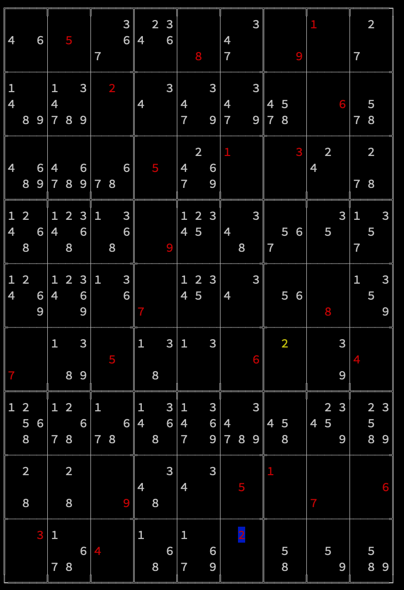

# About
Sudoku solver step by step in terminal.

# How to
1. change the the sudoku in main.cpp to whatever your puzzle is:
``` C++
    Sudoku sudoku(
        " 5  8 91 "
        "  2    6 "
        "   5 13  "
        "   9     "
        "   7   8 "
        "7 5  6  4"
        "         "
        "  9  5176"
        "3 4  2   ");
```

2. run `./build.macos.sh` to compile.
3. run `./a.out` to execute.
4. either click `a` to see the final result, or click `l` to watch every step.
5. you can click `h` to go to previous step.

# Why
The purpose is to help we human to understand how to solve a Sudoku step by step. So,
1. we don't use backstrace searching. We use rule that human can use in real practice.
2. we show all possible candidates in the grid.
3. we show for what reason some candidates become impossible.

Screenshot as below:
